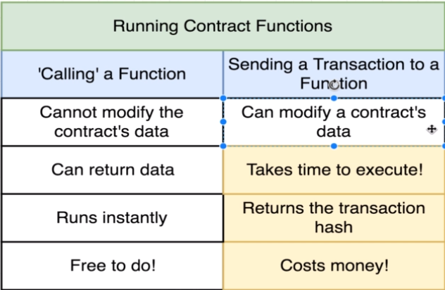
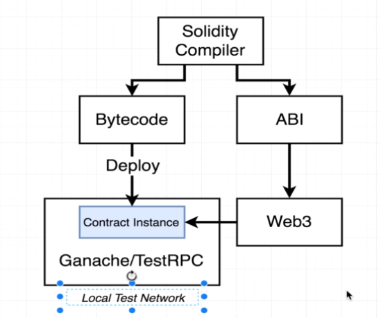
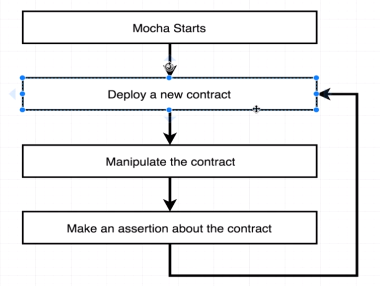
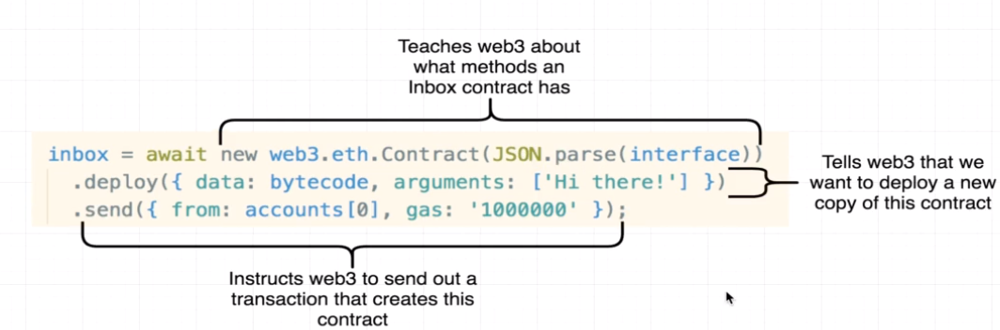
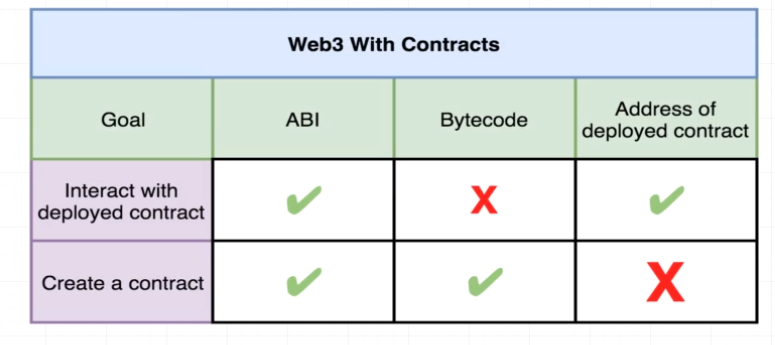
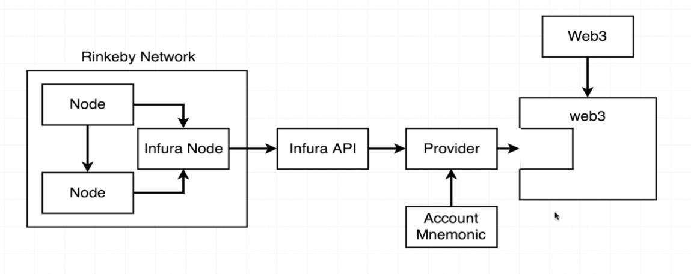
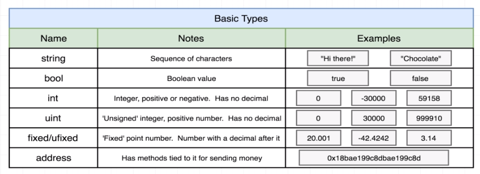

# lottery 🎰

## Background
What is Solidity?

Solidity is an object-oriented programming language for implementing smart contracts on various blockchain platforms, most notably, Ethereum. It was developed by Christian Reitwiessner, Alex Beregszaszi, and several former Ethereum core contributors. Programs in Solidity run on Ethereum

Solidity is an advanced programming language used for implementing Ethereum-based smart contracts. It's an object-oriented language that targets the Ethereum virtual machine (EVM). This language is statically-typed (means variable types known at run-time) and supports complex programming features such as inheritance and user-defined data types

## Transaction Properties

## Web3 Versioning

Whenever we make use of web3 we make use of its constructor.
In general you use on one instance of Web3 at a time.

### v0.x.x  ⚠️
primitive interface - only callback for async code
### v1.x.x  
support for promises + async/await

Portal to ethereum network

## Testing

### Mocha testing

#### Testing accounts

#### Web3 constructor overview for testing.

#### Contract ABI Specification
##### Basic Design
The Contract Application Binary Interface (ABI) is the standard way to interact with contracts in the Ethereum ecosystem, 

### Deploy Contract

### Basic types

### Reference types

